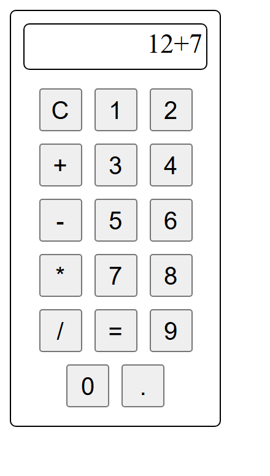

<div align="center">

# 🧮 Calculator

**A simple web calculator for basic arithmetic, built with HTML, CSS and JavaScript**

[](https://mayankksingh5.github.io/Calculator/Calculator.html)




</div>

## ✨ Features

- ➕ ➖ ✖️ ➗ Addition, subtraction, multiplication and division
- 🔢 Digits 0–9 and decimal point
- 🧹 **C** clears the display
- 🟰 **=** evaluates the full expression

## 🚀 Run locally

```bash
git clone https://github.com/mayankksingh5/Calculator.git
cd Calculator
# open Calculator.html in your browser
```

## 📁 Project structure

```
Calculator/
├── Calculator.html   # buttons, display and logic
└── Calculator.css    # styling
```

## 👤 Author

**Mayank Kumar Singh** · Associate DevOps Engineer

[](https://mayank-portfolio.mayankksingh5.workers.dev)
[](https://github.com/mayankksingh5)
[](https://www.linkedin.com/in/mayank-singh-298718204)

<sub>⭐ If you found this project useful, consider giving it a star.</sub>
